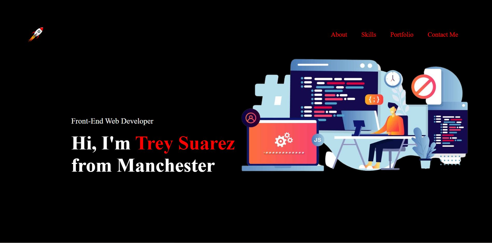

# First-Portfolio 

## Description

This project is the beginning of my bootcamp portfolio. I will use this project to show case my portofolio works from my bootcamp experience. 
To create this portfolio I used HTML5, CSS and Javascript. 

HTML5 was used to create the layout of the webpage along with my different sections. CSS was used to style each section and to create css varaibles for global changes. Javascript was used to create a side menu for smaller displays for easy navigation. 

## Usage

## Credits

Some assets were taken from font awesome cdn to create image icons 

## License

MIT License

---

## Features

Navigations hover effects on Nav section list   
Nav bar for smaller screens  
Scalling effects on skill set section  
Scalling effects on portfolio images 
